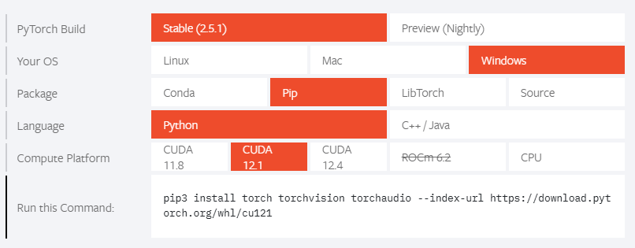

# CPG-RL

## Virtual Environment

### Set up the virtual environment
```
conda create -n cpg-rl python=3.9
```

### Activate the virtual environment

```
conda activate cpg-rl
```

### Install Dependencies

```
pip install -r requirements.txt
```

### Install PyTorch

Check the version of CUDA on your machine.
```
nvidia-smi
```
```
Sat Dec 21 15:20:13 2024
+-----------------------------------------------------------------------------+
| NVIDIA-SMI 528.92       Driver Version: 528.92       CUDA Version: 12.0     |
|-------------------------------+----------------------+----------------------+
| GPU  Name            TCC/WDDM | Bus-Id        Disp.A | Volatile Uncorr. ECC |
| Fan  Temp  Perf  Pwr:Usage/Cap|         Memory-Usage | GPU-Util  Compute M. |
|                               |                      |               MIG M. |
|===============================+======================+======================|
|   0  NVIDIA GeForce ... WDDM  | 00000000:01:00.0  On |                  N/A |
| N/A   62C    P2    32W /  80W |    664MiB /  8192MiB |      0%      Default |
|                               |                      |                  N/A |
+-------------------------------+----------------------+----------------------+

+-----------------------------------------------------------------------------+
| Processes:                                                                  |
|  GPU   GI   CI        PID   Type   Process name                  GPU Memory |
|        ID   ID                                                   Usage      |
|=============================================================================|
|    0   N/A  N/A      1788    C+G   ...werToys.AdvancedPaste.exe    N/A      |
|    0   N/A  N/A      2652    C+G   ...me\Application\chrome.exe    N/A      |
|    0   N/A  N/A      8928    C+G   ...logioptionsplus_agent.exe    N/A      |
|    0   N/A  N/A      9996    C+G   ...8bbwe\WindowsTerminal.exe    N/A      |
|    0   N/A  N/A     10288    C+G   C:\Windows\explorer.exe         N/A      |
|    0   N/A  N/A     10304    C+G   ...ws\System32\ShellHost.exe    N/A      |
|    0   N/A  N/A     10980    C+G   ...y\ShellExperienceHost.exe    N/A      |
|    0   N/A  N/A     11808    C+G   ...n1h2txyewy\SearchHost.exe    N/A      |
|    0   N/A  N/A     11832    C+G   ...artMenuExperienceHost.exe    N/A      |
|    0   N/A  N/A     12840    C+G   ...2txyewy\TextInputHost.exe    N/A      |
|    0   N/A  N/A     13548    C+G   ...03.112\msedgewebview2.exe    N/A      |
|    0   N/A  N/A     14280    C+G   ...03.112\msedgewebview2.exe    N/A      |
|    0   N/A  N/A     14616    C+G   ...r\LogiAiPromptBuilder.exe    N/A      |
|    0   N/A  N/A     15464    C+G   ...oft OneDrive\OneDrive.exe    N/A      |
|    0   N/A  N/A     16188    C+G   ...mmandCenterBackground.exe    N/A      |
|    0   N/A  N/A     16488    C+G   ...rograms\cursor\Cursor.exe    N/A      |
|    0   N/A  N/A     16700    C+G   ...pps\PowerToys.Peek.UI.exe    N/A      |
|    0   N/A  N/A     16848    C+G   ...werToys.PowerLauncher.exe    N/A      |
|    0   N/A  N/A     17340    C+G   ...werToys.ColorPickerUI.exe    N/A      |
|    0   N/A  N/A     17400    C+G   ...\PowerToys.FancyZones.exe    N/A      |
|    0   N/A  N/A     22460    C+G   ...lPanel\SystemSettings.exe    N/A      |
|    0   N/A  N/A     22468    C+G   ...\ApplicationFrameHost.exe    N/A      |
+-----------------------------------------------------------------------------+
```

Install PyTorch with the same version of CUDA.
[PyTorch](https://pytorch.org/)

```
pip install torch torchvision torchaudio --index-url https://download.pytorch.org/whl/cu121
```


